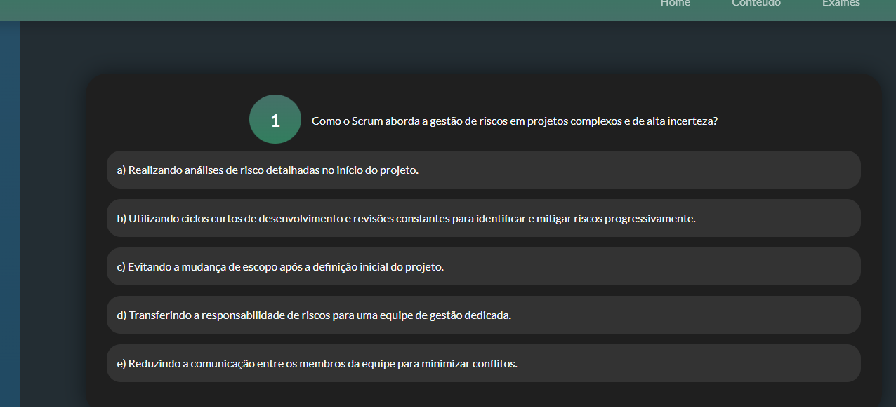

# Manual de usuário

## 1. Introdução

### Objetivo do Manual

Este manual tem como objetivo guiar os usuários na utilização do site Scrum Academy, oferecendo instruções detalhadas sobre suas funcionalidades e recursos.

### Visão Geral do Scrum Academy

O Scrum Academy é uma plataforma online dedicada a ensinar a metodologia ágil Scrum, ajudando funcionários a incorporá-la em suas rotinas de trabalho.

## 2. Primeiros Passos

### Requisitos de Sistema

Para acessar o Scrum Academy, você precisará de:

- Um dispositivo com acesso à internet
- Um navegador web atualizado (Google Chrome, Mozilla Firefox, etc.)
- Conexão com a internet

### Como Acessar o Site

- Abra seu navegador e digite o URL do Scrum Academy:

http://scrumacademy.ddns.net:5000/

- Confirme a busca (tecla “Enter”, por exemplo)

## 3. Navegação pelo Site

### Página Inicial

A página inicial fornece uma visão geral dos cursos disponíveis, uma introdução breve sobre o que será abordado no site, alguns cards com algumas informações sobre cada um dos 6 conteúdos presentes no site que se clicados, levarão o usuário direto para o conteúdo do respectivo card. Abaixo dos cards de conteúdos, há um botão “Iniciar”,  que levará direto para o exame final. Ainda acima do rodapé, há 5 botões para navegação entre “Home”, “Conteúdo”, “Exames”, “Resultados” e “Sobre Nós”.

No rodapé, há o ícone do GitHub que se clicado, levará para o GitHub de nossa equipe, a Bug Busters

### Menu de Navegação

O menu de navegação, ou barra de navegação está localizada no canto superior do site e está presente em todas as páginas de conteúdo. Nele, há o botão “Home” que levará para a página inicial, botão “Conteúdo” que mostrará todos os conteúdos do curso que se clicados, levarão o usuário até eles, botão “Exames”,  que levará à página de exame final, botão “Resultados” que levará para a página de resultados

## 4. Funcionalidades do Site

### Cadastro e Login

- Clique em "Login", no canto direito da “Barra de Navegação”;
- Insira o email que será utilizado para salvar os seus dados no site;
- Insira seu nome completo;
- Caso já tenha se cadastrado anteriormente, o usuário, ao inserir o email, já logará automaticamente.

### Certificados

- Receba certificados ao concluir cursos.

## 5. Utilização dos Conteúdos

### Como Iniciar um Conteúdo

- Navegue por meio da barra de navegação em “Conteúdo”
- Clique no conteúdo desejado

### Estrutura dos Conteúdos

- Cada conteúdo é dividido em seções, sendo estas:
- Texto: Todas as informações que devem ser aprendidas sobre o respectivo conteúdo estarão nesta seção;
- Em Resumo: Breve resumo sobre o texto principal;
- Na Prática: Exemplificação da utilização do que foi aprendido no respectivo conteúdo;
- Quiz: Um quiz simples com duas questões em cada conteúdo;
- Referências: Haverá um botão “Visualizar” que ao ser clicado, mostrará os respectivos links utilizados.

### Exercícios e Avaliações

- Complete os quizzes ao final de cada conteúdo para testar seu conhecimento.
- Os quizzes tem questões de múltipla escolha ou escolha única, relação e escolha de palavras que melhor se encaixam no texto mostrado.

## 6. User Pathing

### Caminho do Usuário

- Digite a URL do site:

- Faça cadastro/login:

- Digite seu email e clique em “Enviar”:

- Se já estiver cadastrado:

>*Obs:* *Atenção, o nome que for cadastrado aqui não poderá ser alterado e será ele que aparecerá em seu certificado ao finalizar o curso.
- Se ainda não se cadastrou, preencha com nome completo:*
>

- Note que seu nome aparece onde antes estava o botão Login:

- Agora, para começar os estudos, clique em Conteúdo, na Barra de Navegação:

- Note que aparecerá uma área de navegação entre os conteúdos:

- Clique no conteúdo desejado, como no exemplo:

- Estude o conteúdo de cada página, isso inclui as seções Em Resumo e Na Prática:

- Você pode navegar dentro da página do conteúdo pelos botões mostrados na imagem abaixo:

- Após já ter lido o conteúdo, você já está preparado para o quiz:

- Assinale as alternativas que acreditar serem corretas como no exemplo:

- Clique em Enviar Quiz:

- Aparecerá quantas questões você acertou, junto de um botão para prosseguir para o próximo conteúdo. Para sair dessa janela, apenas clique em qualquer lugar da tela fora dela:

- Para todos os conteúdos, o caminho é o mesmo.
- Se você já estudou todo o conteúdo do site e está se sentindo confiante, pode fazer o exame final. Lembre-se, a nota do exame final é definitiva e única por conta registrada.

- Clique em Exames, na barra de navegação:

- Você entrará nesta página:

> *Obs:* *Lembre-se de estar logado antes de entrar na página de Exame Final, pois caso não estiver, ao tentar enviar o exame, você será levado a tela inicial e suas respostas não serão guardadas.*
> 

- Para responder às questões do exame, clique na pergunta:

- Note que apareceram as alternativas de respostas para a questão:

- Selecione as alternativas corretas em todas as questões:

- Ao responder todas as questões e tiver certeza absoluta de suas respostas, clique em “Enviar Exame” no final da página:

- Aparecerá uma mensagem como na imagem abaixo:

- Antes de ir para a página de resultados, é obrigatório dar um feedback que consiste em uma nota de 1 a 5 que é dada através das estrelas, e um comentário breve. Esperamos sinceridade em seus feedbacks, pois assim, saberemos como melhorar:
